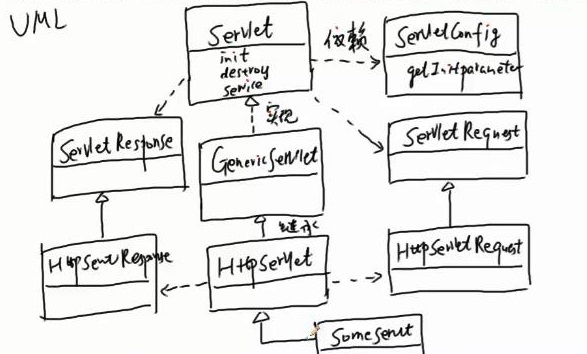

# servlet

sun 公司制订的一种用来扩展 web 服务器功能的组件规范。

1. 实现 Servlet 接口或者继承 HttpServlet 抽象类。

2. 编译

3. 打包，即创建一个具有如下结构的文件夹：

```
    appname(应用名)
      └──WEB-INF
          ├──classes    .class文件
          ├──lib        .jar文件，lib文件夹可选
          └──web.xml    部署描述文件
```

4. 将 step3 创建的文件夹拷贝到 servlet 窗口特定的文件夹下。也可以将 step3 创建的文件夹使用 jar 命令压缩，生成 .war 为后缀的文件。
 
5. 启动 servlet 容器，访问 servlet。`http://ip:port/appname/url-pattern`


### 完成第一个 servlet 程序

1、新建一个 web 工程，目录结构如下

```
    web01(工程文件存放目录)
      ├──src
      │   └──com.herolei            .class文件
      │       └──HelloWorldServlet  部署描述文件 
      ├──web
      │   ├──WEB-INF
      │   │   └──web.xml            web配置文件
      │   └──index.jsp
      └──web01.iml
```

2、在 `src -> com.herolei -> HelloWorldServlet.java` 文件中中添加如下代码

```java
package com.herolei;

import javax.servlet.ServletException;
import javax.servlet.http.HttpServlet;
import javax.servlet.http.HttpServletRequest;
import javax.servlet.http.HttpServletResponse;
import java.io.IOException;
import java.io.PrintWriter;

public class HelloWorldServlet extends HttpServlet {

    public void service(HttpServletRequest req, HttpServletResponse res) throws IOException, ServletException {
        //1、读请求参数值
        String qtyStr = req.getParameter("qty");
        int qty = Integer.parseInt(qtyStr);
        //2、处理请求
        String rs = "";
        for (int i = 0; i < qty; i++) {
            rs += "<h1>Hello World</h1>";
        }
        //3、设置一个消息头content-type，告诉浏览器返回的数据类型是一个html文档及编码格式
        //告诉服务器使用out输出时使用指定的编码格式进行编码
        res.setContentType("text/html;charset=utf-8");
        //4、获得一个输出流
        PrintWriter out = res.getWriter();
        //5、调用流的方法进行输出，其实质是将处理结果写到了res对象上
        out.println(rs);
        out.close();
    }
}
```

3、修改 `web -> WEB-INF -> web.xml` 配制文件 

```xml
<?xml version="1.0" encoding="UTF-8"?>
<web-app xmlns="http://xmlns.jcp.org/xml/ns/javaee"
         xmlns:xsi="http://www.w3.org/2001/XMLSchema-instance"
         xsi:schemaLocation="http://xmlns.jcp.org/xml/ns/javaee http://xmlns.jcp.org/xml/ns/javaee/web-app_3_1.xsd"
         version="3.1">
    <servlet>
        <servlet-name>helloWord</servlet-name>
        <!--类名要完整(包名，类名都要全)-->
        <servlet-class>com.herolei.HelloWorldServlet</servlet-class>
    </servlet>
    <servlet-mapping>
        <servlet-name>helloWord</servlet-name>
        <url-pattern>/hello</url-pattern>
    </servlet-mapping>
</web-app>
```

4. 启动程序，访问 http://localhost:8080/hello?qty=30

### servlet 是如何运行的？

1. 浏览器依据ip, port 建立与 servlet 容器之间的连接。

2. 浏览器将请求数据打包(即按照 http 协议的要求，将相关数据封闭成一个数据包，即请求数据包)并发送给 servlet 容器。

3. servlet 容器解析请求数据包，并将解析后的数据放到 request 对象上。同时创建一个 response 对象。

4. servlet 容器依据请求资源路径找到 servlet 的配置，然后创建 servlet 对象。

5. servlet 调用 service 方法，并且会将事先创建好的 request 对象和 response 对象作为 service 方法的参数传递给 servlet 对象。

6. servlet 通过 request 对象获得请求参数，进行相应的处理，然后将处理结果写到 response 对象上。

7. servlet 读取 response 对象上的数据，然后将处理结果打包(响应数据包)并发送给浏览器。

8. 浏览器解析响应数据包，将返回的数据展现给用户。

### servlet 如何处理请求资源路径

1. servlet 容器会先假设访问的是一个 servlet ，会依据应用名(appname)找到应用所在的文件夹，然后找到 web.xml 文件。

2. 匹配 <url-pattern></url-pattern>

    * 精确匹配(完全匹配)
    
    * 通配符匹配：使用 `*` 匹配任意长度的字符串。eg: `<url-pattern>/*</url-patten>`
        
    * 后缀匹配：使用 `*.` 开头，后面可以接任意字符。eg: `<url-pattern>*.do</url-patten>`
    
3. 如果都不匹配，则容器认为访问的是一个静态资源文件(html/css/js)，如果找到则返回，否则返回404。

### servlet 的生命周期

serlet 的生命周期指 servlet 容器如何去创建 servlet 对象、如何给 servlet 对象分配资源、如何调用 servlet 对象的方法来处理请求、以及如何销毁 servlet 对象的整个过程。

servlet 生命周期的四个阶段：

1. 实例化：容器调用 servlet 的构造器，创建 servlet 对象。

    * 情况1：容器收到请求后才创建 servlet 对象。默认，容器只会为 servlet 创建唯一一个实例。
    
    * 情况2： 容器启动时交某些 servlet 对象创建好(需要配置 load-on-startup)。load-on-startup 参数值必须是 >=0 的整数，越小优先级(即先实例化)越高。
    
2. 初始化：容器在创建好 servlet 对象后，立即调用 init() 方法。

    * init() 只执行一次
    
    * GenericServlet 已经实现了 init()，该方法会将容器创建好的 ServletConfig 对象作为参数传给 init()。
    
    * ServletConfig 对象提供一个 getInitParameter() 来访问 servlet 的初始化参数。
    
    * 如果 GenericServlet 的 init() 提供的初始化操作不满足需要，可以重写 init() 无参方法，不重写 init(ServletConfig config)
    
3. 就绪：servlet 对象可以调用了，容器收到请求后，会调用 servlet 对象的 service() ，该方法会依据请求类型(get/post)分别调用 doGet(), doPost() 

4. 销毁：servlet 容器在销毁 servlet 对象之前，会调用 destroy()

补充：生命周期相关的几个接口与类



1) Servlet 接口：`init(ServletConfig config)`、`service(ServletRequest req, ServletResponse res)`、`destroy()`

2) GenericServlet 抽象类：实现了 Servlet 接口中的 init, destroy 方法

3) HttpServlet 抽象类：继承了 GenericServlet 抽象类，实现了 service()

4) ServletConfig 接口：String getInitParameter(String paraName)

5) ServletRequest 接口是 HttpServletRequest 的父接口

6) ServletResponse 接口是 HttpServletResponse 的父接口


### jsp(java server page) java 服务器端动态页面

sun 公司制订的一种服务器端的动态页面生成技术规范。jsp 是一个以 .jsp 为后缀的文件，容器会自动将 .jsp 文件转换成一个 .java 文件(其实就是一个 servlet)，然后调用 servlet。所以本质上，jsp 就是一个 servlet 。