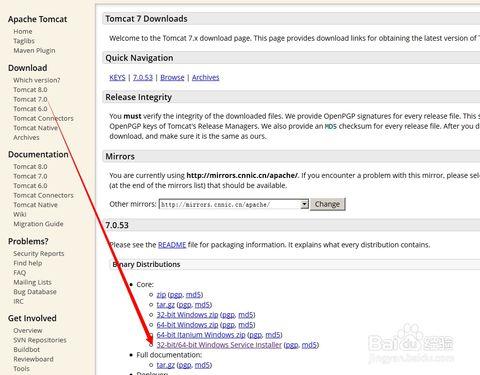
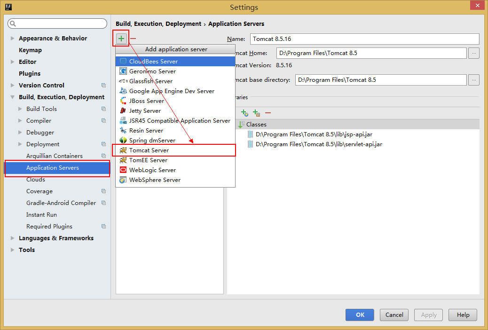
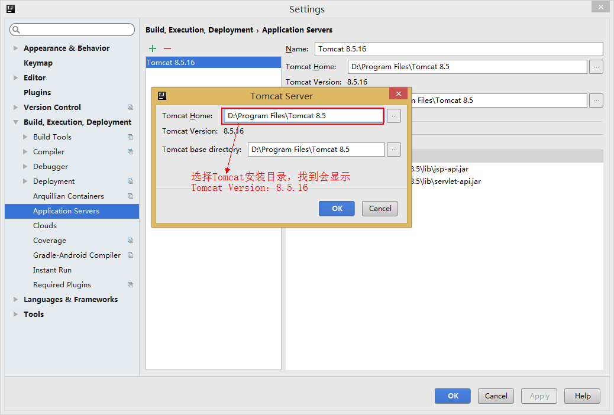

## IDEA 如何启动 Java 项目

#### 安装 Tomcat

1. 在官网下载软件：tomcat.apache.org/download-70.cgi

2. 双击运行：apache-tomcat.exe，直至安装成功。

#### IDEA 加载 Tomcat 应用

1. `File -> Settings -> Application Servers`，打开 `Application Servers` 配制，点击 `+` ，选择 `Tomcat Server` 。

2. 选择 `Tomcat` 安装目录，成功会显示 `Tomcat` 版本信息。

#### IDEA 编辑 Configurations