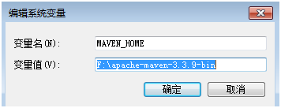
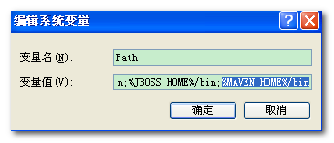
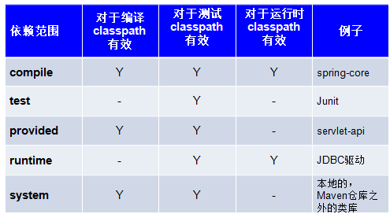

## maven

### 安装 

第一步：下载 http://maven.apache.org/download.cgi

第二步：解压 将 maven 解压拷贝到 D:\Program Files\Maven

* `bin` mvn.bat(以run方式运行项目)、 mvnDebug.bat(以debug方式运行项目)
* `boot` maven 运行需要类加载器 
* `conf` settings.xml 整个 maven 工具核心配置文件 
* `lib` maven 运行依赖 jar 包

第三步：配置环境变量

* 电脑上需安装java环境，安装JDK1.7+ 版本，将 %JAVA_HOME%/bin 配置环境变量path

* 配置 MAVEN_HOME 环境变量，将 %MAVEN_HOME%/bin 加入环境变量 path



将 MAVEN_HOME/bin 添加到环境变量


第四步：配置本地仓库 conf/setting.xml

    <localRepository>D:\Program Files\Maven\LocalRepository</localRepository>
    
### maven常用命令

* `compile` maven 工程的编译命令，作用是将 src/main/java 下的文件编译为class文件输出到target目录下 mvn compile

* `test` maven 工程的测试命令，会执行 src/test/java 下的单元测试类

* `clean` maven 工程的清理命令，执行 clean 会删除 target 目录的内容

* `package` maven 工程的打包命令，对于 java 工程执行 package 打成 jar/war 包

* `install` maven 工程的安装命令，执行 install 将 maven 打成 jar/war 包发布到本地仓库

### pom基本配置

pom.xml是Maven项目的核心配置文件，位于每个工程的根目录，基本配置如下：

* `<project>` 文件的根节点
* `<modelversion >` pom.xml 使用的对象模型版本
* `<groupId >` 项目名称，一般写项目的域名
* `<artifactId>` 模块名称，子项目名或模块名称
* `<version>` 产品的版本号
* `	<packaging>` 打包类型 jar/war/pom
* `<name>` 项目的显示名，常用于 Maven 生成的文档  
* `<description>` 项目描述，常用于 Maven 生成的文档
* `<dependencies>` 项目依赖构件配置，配置项目依赖构件的坐标
* `<build>` 项目构建配置，配置编译、运行插件等
 
**引入jar包：**
 
```xml
<!-- 依赖关系 -->
<dependencies>
    <!-- 此项目运行使用junit，所以此项目依赖junit -->
    <dependency>
        <!-- junit的项目名称 -->
        <groupId>junit</groupId>
        <!-- junit的模块名称 -->
        <artifactId>junit</artifactId>
        <!-- junit版本 -->
        <version>4.9</version>
        <!-- 依赖范围：单元测试时使用junit -->
        <scope>test</scope>
    </dependency>
</dependencies>
```

依赖范围包括:


**引入插件：**

```xml
<build>
    <plugins>
        <!--调整JDK版本及编码-->
        <plugin>
            <groupId>org.apache.maven.plugins</groupId>
            <artifactId>maven-compiler-plugin</artifactId>
            <configuration>
                <source>1.7</source>
                <target>1.7</target>
                <encoding>UTF-8</encoding>
            </configuration>
        </plugin>
        <!-- maven配制tomcat7插件 -->
        <plugin>
            <groupId>org.apache.tomcat.maven</groupId>
            <artifactId>tomcat7-maven-plugin</artifactId>
            <version>2.2</version>
            <configuration>
                <!-- 可以灵活配置工程路径 -->
                <path>/ssh</path>
                <!-- 可以灵活配置端口号 -->
                <port>8080</port>
            </configuration>
        </plugin>
    </plugins>
</build>
```


 


