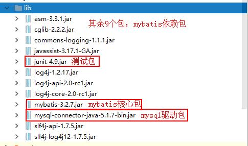

## mybatis

### mybatis入门程序 

第一步：IDEA 创建 mybatis 工程

第二步：导入 jar 包

* mybatis-3.2.7(10个)：mybatis-3.2.7.jar(1个) 及其依赖包(9个)
    
* 数据库驱动(1个)：mysql-connector-java-5.1.7-bin.jar

* 测试包(1个)：junit-4.9.jar



第三步：log4j.properties

在 classpath 下创建 log4j.properties

```properties
# Global logging configuration
log4j.rootLogger=DEBUG, stdout
# Console output...
log4j.appender.stdout=org.apache.log4j.ConsoleAppender
log4j.appender.stdout.layout=org.apache.log4j.PatternLayout
log4j.appender.stdout.layout.ConversionPattern=%5p [%t] - %m%n
```

第四步：SqlMapConfig.xml

在 classpath 下创建 SqlMapConfig.xml，如下：

```xml
<?xml version="1.0" encoding="UTF-8"?>
<!DOCTYPE configuration
        PUBLIC "-//mybatis.org//DTD Config 3.0//EN"
        "http://mybatis.org/dtd/mybatis-3-config.dtd">
<configuration>
    <!-- 和spring整合后 environments配置将废除-->
    <environments default="development">
        <environment id="development">
        <!-- 使用jdbc事务管理-->
            <transactionManager type="JDBC"/>
            <!-- 数据库连接池-->
            <dataSource type="POOLED">
                <property name="driver" value="com.mysql.jdbc.Driver"/>
                <property name="url" value="jdbc:mysql://localhost:3306/mybatis?characterEncoding=utf-8"/>
                <property name="username" value="root"/>
                <property name="password" value="root"/>
            </dataSource>
        </environment>
    </environments>
    
    <!--加载映射文件-->
    <mappers>
        <mapper resource="User.xml" />
    </mappers>
    
</configuration>
```

第五步：po 类

Po 类作为 mybatis 进行 sql 映射使用，po 类通常与数据库表对应，User.java 如下：

```java
import java.io.Serializable;
import java.util.Date;

public class User implements Serializable {
	private int id;
	private String username;// 用户姓名
	private String sex;     // 性别
	private Date birthday;  // 生日
	private String address; // 地址

	public int getId() {
		return id;
	}
	public void setId(int id) {
		this.id = id;
	}
	public String getUsername() {
		return username;
	}
	public void setUsername(String username) {
		this.username = username;
	}
	public String getSex() {
		return sex;
	}
	public void setSex(String sex) {
		this.sex = sex;
	}
	public Date getBirthday() {
		return birthday;
	}
	public void setBirthday(Date birthday) {
		this.birthday = birthday;
	}
	public String getAddress() {
		return address;
	}
	public void setAddress(String address) {
		this.address = address;
	}
	@Override
	public String toString() {
		return "User [id=" + id + ", username=" + username + ", sex=" + sex
				+ ", birthday=" + birthday + ", address=" + address + "]";
	}
}
```

第六步：sql 映射文件

在 classpath 下的 sqlmap 目录下创建 sql 映射文件 Users.xml：

```xml
<?xml version="1.0" encoding="UTF-8"?>
<!DOCTYPE mapper
        PUBLIC "-//mybatis.org//DTD Mapper 3.0//EN"
        "http://mybatis.org/dtd/mybatis-3-mapper.dtd">
        
<!--namespace ：命名空间，用于隔离sql语句，-->
<mapper namespace="test">
    <select id="findUserById" parameterType="java.lang.Integer" resultType="com.herolei.pojo.User">
        SELECT * FROM user WHERE id=#{id}
    </select>
</mapper>
```

第七步：UserTest 测试文件

```java
import com.herolei.pojo.User;
import org.apache.ibatis.io.Resources;
import org.apache.ibatis.session.SqlSession;
import org.apache.ibatis.session.SqlSessionFactory;
import org.apache.ibatis.session.SqlSessionFactoryBuilder;
import org.junit.Test;
import java.io.IOException;
import java.io.InputStream;

public class UserTest {

    @Test
    public void testFindUserById() throws IOException {
        String resource = "SqlMapConfig.xml";
        //通过流将核心配置文件读取进来
        InputStream inputStream = Resources.getResourceAsStream(resource);
        //通过核心配置文件输入流来创建会话工厂
        SqlSessionFactory factory = new SqlSessionFactoryBuilder().build(inputStream);
        //通过工厂创建会话
        SqlSession openSession = factory.openSession();
        //执行sql,返回user
        User user = openSession.selectOne("test.findUserById", 1);

        System.out.println( user);
    }
}
```

### 7 SqlMapConfig.xml配置文件

**properties(属性)**
settings(全局配置参数)
**typeAliases(类型别名)**
typeHandlers(类型处理器)
objectFactory(对象工厂)
plugins(插件)
environments(环境集合属性对象)
  environment(环境子属性对象)
    transactionManager(事务管理)
    dataSource(数据源)
**mappers(映射器）**

#### 7.1 properties(属性)

第一步：在 classpath 下定义 db.properties 文件

```
jdbc.driver=com.mysql.jdbc.Driver
jdbc.url=jdbc:mysql://localhost:3306/mybatis?characterEncoding=utf-8
jdbc.username=root
jdbc.password=root
```

第二步：在 classpath 下 SqlMapConfig.xml 引用如下

```xml
<properties resource="db.properties"/>
<environments default="development">
    <environment id="development">
        <transactionManager type="JDBC"/>
        <dataSource type="POOLED">
            <!--可以直接使用db.properties配置文件-->
            <property name="driver" value="${jdbc.driver}"/>
            <property name="url" value="${jdbc.url}"/>
            <property name="username" value="${jdbc.username}"/>
            <property name="password" value="${jdbc.password}"/>
        </dataSource>
    </environment>
</environments>
```

####  7.3 typeAliases(类型别名)

**7.3.1 mybatis 支持别名：**

别名 | 映射的类型
---- | ----
_byte | byte 
_long | long 
_short | short 
_int | int 
_integer | int 
_double | double 
_float | float 
_boolean | boolean 
string | String 
byte | Byte 
long | Long 
short | Short 
int | Integer 
integer | Integer 
double | Double 
float | Float 
boolean | Boolean 
date | Date 
decimal | BigDecimal 
bigdecimal | BigDecimal 
map | Map

**7.3.2	自定义别名：**

```xml
<typeAliases>
	<!-- 单个别名定义 -->
	<typeAlias alias="user" type="cn.itcast.mybatis.po.User"/>
	<!-- 批量别名定义，扫描整个包下的类，别名为类名（首字母大写或小写都可以） -->
	<package name="cn.itcast.mybatis.po"/>
	<package name="其它包"/>
</typeAliases>
```

#### 7.3 mappers(映射器）

```xml

```

### 8 输入映射和输出映射

### 9 动态sql

#### 9.1 if

```xml
<select id="findUserByUsernameAndSex" parameterType="com.herolei.pojo.User" resultType="com.herolei.pojo.User">
    SELECT * FROM user WHERE 1=1
    <if test="username != null and username != ''">
        and username=#{username}
    </if>
    <if test="sex!=null and sex!=''">
        and sex=#{sex}
    </if>
</select>
```

#### 9.2 where

```xml
<select id="findUserByUsernameAndSex" parameterType="com.herolei.pojo.User" resultType="com.herolei.pojo.User">
  SELECT * FROM user
    <where>
        <if test="username != null and username != ''">
            and username=#{username}
        </if>
        <if test="sex!=null and sex!=''">
            and sex=#{sex}
        </if>
    </where>
</select>
```

#### 9.3 foreach

```xml
<select id="findUsersByIds" parameterType="com.herolei.pojo.QueryVo" resultType="com.herolei.pojo.User">
    SELECT * FROM user
    <where>
      <!--foreach参数
        collection: 要循环的集合
        item: 循环的每一项
        open: 循环开始拼接的字符串
        close: 循环结束拼接的字符串
        separator: 循环中拼接的字符串-->
      <foreach collection="ids" item="id" open="id in (" close=")" separator=",">
          #{id}
      </foreach>
    </where>
</select>
```

#### 9.4 sql片段

```xml
<sql id="idsCondition">
  <where>
      <foreach collection="ids" item="id" open="id in (" close=")" separator=",">
          #{id}
      </foreach>
  </where>
</sql>

<select id="findUsersByIds" parameterType="com.herolei.pojo.QueryVo" resultType="com.herolei.pojo.User">
    SELECT * FROM user
    <include refid="idsCondition" />
</select>
```


