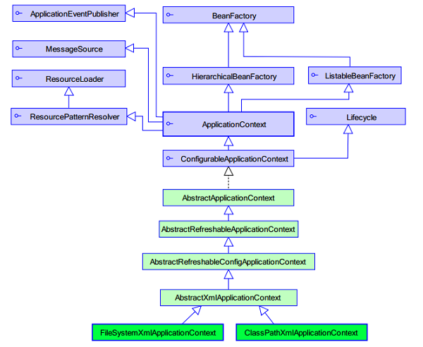

## 1.2 Spring中的工厂

### 1.2.1 ApplicationContext

`ApplicatioContext` 接口有两个实现类:

* `ClassPathXmlApplicationContext` 加载类路径下 Spring 的配置文件。

* `FileSystemXmlApplicationContext` 加载本地磁盘下 Spring 的配置文件。



使用方法：

```java
    //ClassPathXmlApplicationContext 加载类路径下 Spring 的配置文件
    ApplicationContext context = new ClassPathXmlApplicationContext("demo1/applicationContext.xml");

    //FileSystemXmlApplicationContext 加载本地磁盘下 Spring 的配置文件
    //ApplicationContext context = new FileSystemXmlApplicationContext("F:\\test\\java_test\\spring_01\\src\\demo1\\applicationContext.xml");


    HelloWorld hw = (HelloWorld) context.getBean("helloWorld");
    hw.sayHello();
```

### 1.2.2 ~~BeanFactory~~(了解)

```java
    //BeanFactory已过时
    BeanFactory factory = new XmlBeanFactory(new ClassPathResource("demo1/applicationContext.xml"));
    HelloWorld hw = (HelloWorld) factory.getBean("helloWorld");
    hw.sayHello();
```

### 1.2.3 BeanFactory和ApplicationContext的区别

* `BeanFactory` : 采取延迟加载，第一次 getBean 时才会初始化 Bean

* `ApplicationContext` : 在加载 applicationContext.xml 时候就会创建具体的 Bean 对象的实例，还提供了如下功能：

    * 事件传递
    
    * Bean 自动装配
    
    * 各种不同应用层的 Context 实现